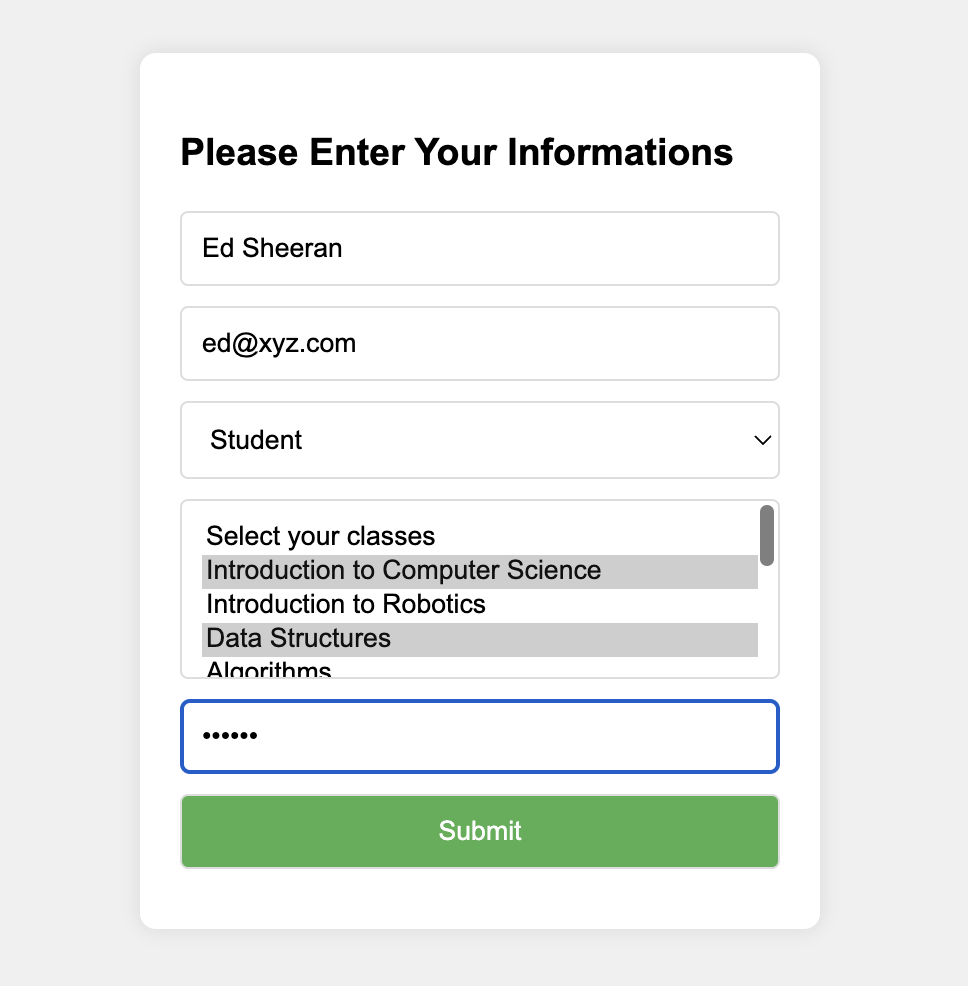
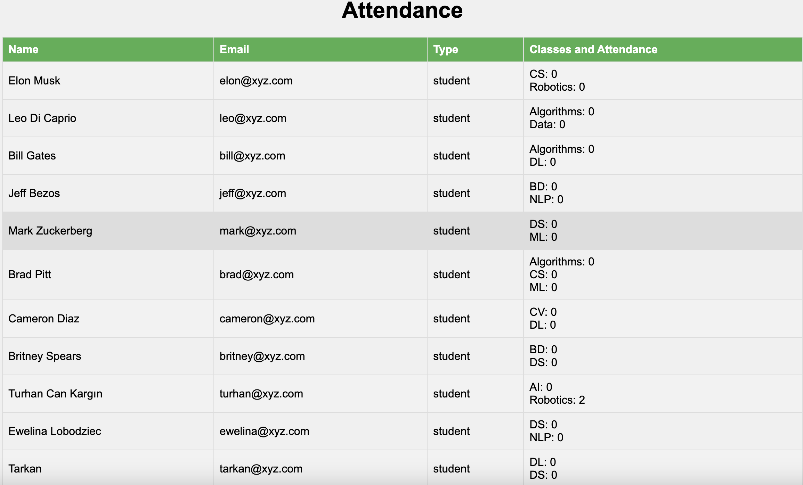
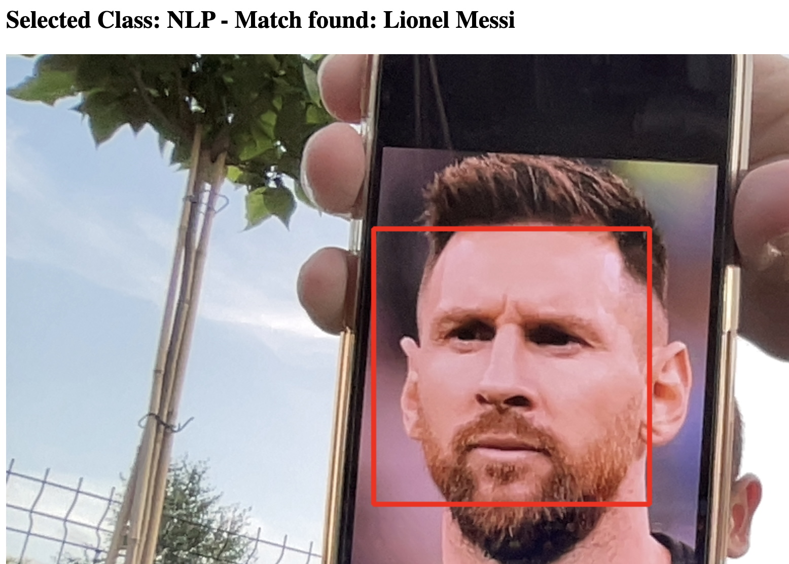
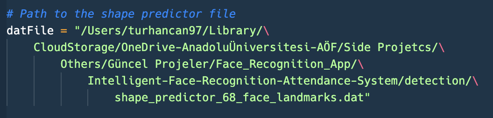
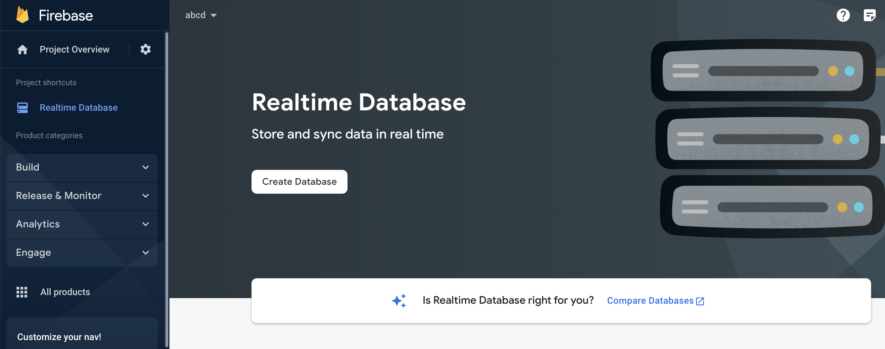
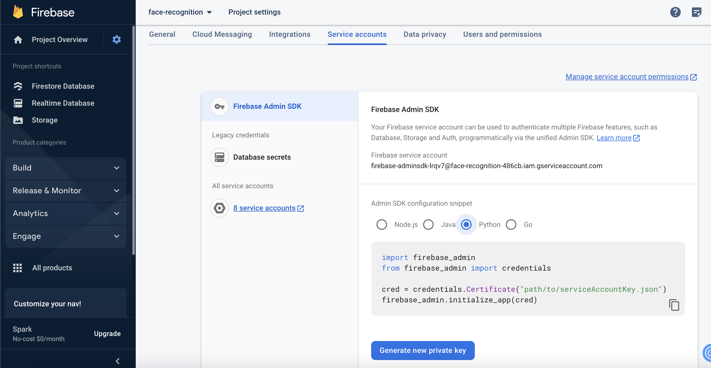
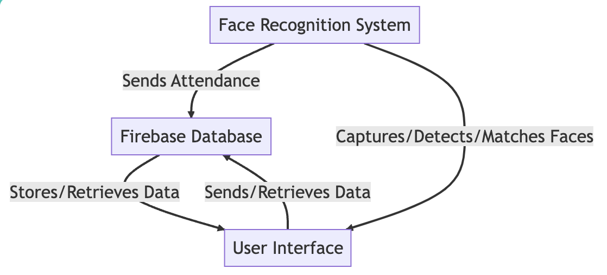
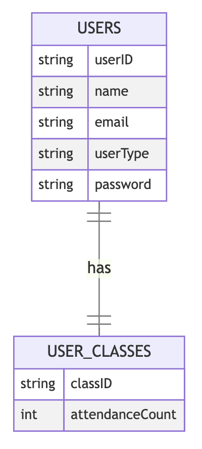
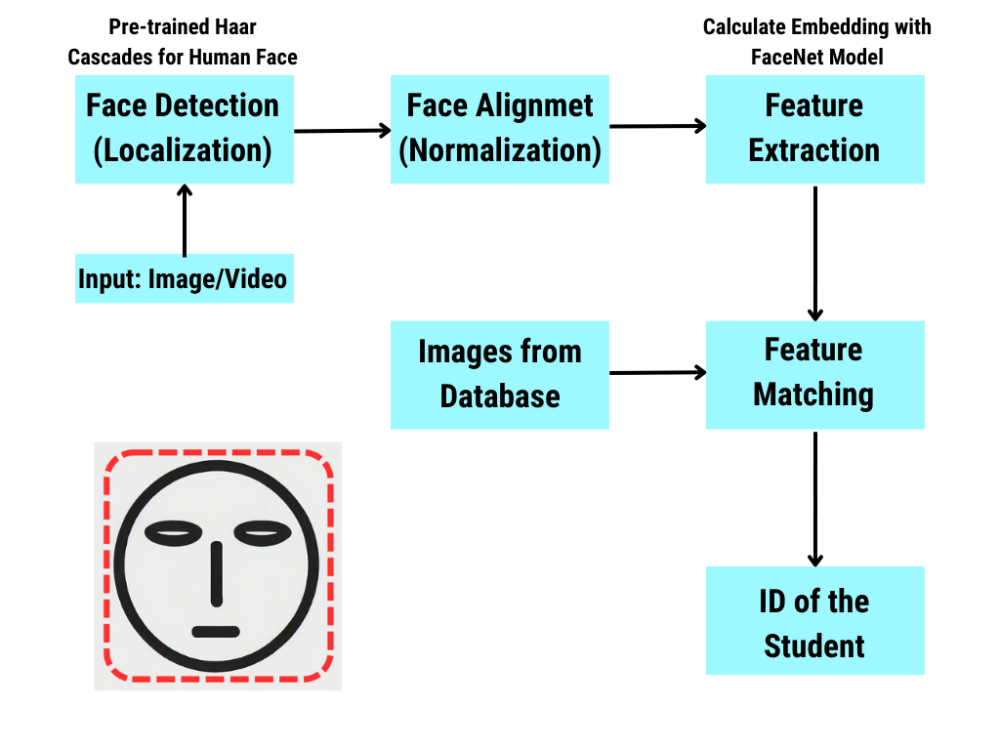

# Face Recognition Attendance System
<div align="center">
    <a></a>
</div>
This project is a comprehensive attendance system that leverages the power of face recognition to identify individuals and mark their attendance. Built with Python, Flask, OpenCV, and Firebase, the system provides an efficient and automated solution to track attendance in various settings such as universities or workplaces. 

The system allows users to upload their image to the database, which is then used to recognize their face during attendance checks. The recognized faces are matched with the database, and the attendance is updated in real-time. The system also includes a secure login feature for teachers to view the attendance records. 

This project is an excellent example of how computer vision and machine learning can be used to automate traditional processes, making them more efficient and accurate.

## Table of Contents

- [Face Recognition Attendance System](#face-recognition-attendance-system)
  - [Table of Contents](#table-of-contents)
  - [Introduction](#introduction)
  - [Project Demo](#project-demo)
  - [Features](#features)
    - [Screenshots](#screenshots)
  - [Installation](#installation)
  - [Usage](#usage)
  - [Dependencies](#dependencies)
  - [Contribution](#contribution)
  - [Future Improvements](#future-improvements)
  - [License](#license)
  - [Technical Information](#technical-information)
    - [System Architecture Design](#system-architecture-design)
    - [Database Design](#database-design)
    - [Face Recognition System Development](#face-recognition-system-development)

## Introduction

In traditional attendance systems, the process of marking attendance is often manual, time-consuming, and prone to errors. With the advent of machine learning and computer vision, we now have the tools to automate this process and make it more efficient and accurate.

Our Face Recognition Attendance System is designed to leverage these technologies to provide a seamless and automated attendance tracking solution. The system uses face recognition technology to identify individuals and mark their attendance. This process eliminates the need for manual entry and reduces the chances of errors or fraudulent entries.

The system is built using Python, Flask, OpenCV, and Firebase. Python and Flask provide the backend functionality, OpenCV is used for face detection and recognition, and Firebase is used as the database to store user information and attendance records.

The system also includes a secure login feature for teachers, allowing them to view the attendance records. This feature ensures that only authorized individuals have access to the attendance data.

Whether you're a university looking to streamline your attendance tracking process or a business looking to automate your employee check-in system, our Face Recognition Attendance System provides a robust and efficient solution.

## Project Demo

***Please Click The Picture Below For the Project Video***

<p align="center">
<a href=https://youtu.be/nRI_oEqiG-g>
</a>
</p>


## Features

The **Face Recognition Attendance System** comes with a host of features designed to make attendance tracking as seamless and efficient as possible:

1. **Face Recognition**: The system uses advanced face recognition technology to identify individuals and mark their attendance. This eliminates the need for manual entry and ensures accuracy in attendance tracking.

2. **Real-Time Attendance Tracking**: The system tracks attendance in real-time. As soon as an individual is recognized by the system, their attendance is marked and updated in the database.

3. **Secure Teacher Login**: The system includes a secure login feature for teachers. This allows teachers to view the attendance records and ensures that only authorized individuals have access to this data.

4. **Multi-Class Support**: The system supports multiple classes. Students can be enrolled in multiple classes, and their attendance is tracked separately for each class.

5. **Database Integration**: The system is integrated with Firebase, a cloud-based NoSQL database. This allows for efficient storage and retrieval of user information and attendance records.

6. **Webcam Support**: The system supports webcam input for face recognition. This makes it easy to set up and use in a variety of settings.

7. **User-Friendly Interface**: The system features a user-friendly interface, making it easy for users to navigate and use the system.

8. **Open Source**: The system is open source. Developers are welcome to contribute and help improve the system.

### Screenshots

<figure align="center"> 
  
  <figcaption>Home Page of the Interface</figcaption>
</figure>

<figure align="center"> 
  
  <figcaption>Page to add student's information to the database (After capture image/upload image)</figcaption>
</figure>

<figure align="center"> 
  
  <figcaption>Page after Teacher Login (Attendance list)</figcaption>
</figure>

<figure align="center"> 
  
  <figcaption>Page after attending the class</figcaption>
</figure>

<figure align="center"> 
  
  <figcaption>Choosing a Class to Attend</figcaption>
</figure>

## Installation

To get the Face Recognition Attendance System up and running on your local machine, follow these steps:

1. **Clone the Repository**: First, clone the repository to your local machine. You can do this by running the following command in your terminal:

   ```
   git clone https://github.com/turhancan97/Intelligent-Face-Recognition-Attendance-System.git
   ```


2. Create a virtual environment and activate it. You can do this by running the following commands in your terminal:

   **python environment**   
   ```
   python3.8 -m venv your_env_name
   ```

   ```
   source your_env_name/bin/activate
   ```
   
   or 

   **conda environment**
   ```
   conda create -n your_env_name python=3.8
   ```

   ```
   conda activate your_env_name
   ```

This will create a virtual environment and activate it. All the dependencies will be installed in this virtual environment. 

3. **Install Dependencies**: Navigate into the cloned project directory and install the necessary dependencies by running:

   ```
   pip install -r requirements.txt
   ```

   This command will install all the necessary libraries and packages listed in the `requirements.txt` file.

   Please note that you need to download the shape predictor file 'shape_predictor_68_face_landmarks.dat' from the dlib website. You can download the file from [here](https://github.com/italojs/facial-landmarks-recognition/blob/master/shape_predictor_68_face_landmarks.dat). You can put the file in the detection folder and you need to write full path of the file in the face_matching.py file for the **datFile** variable as below.

   

4. **Set Up Firebase**: The system uses Firebase for database operations. You need to set up a Firebase project and replace the Firebase configuration in the project with your own. You can follow the [Firebase setup guide](https://firebase.google.com/docs/web/setup) for instructions.
   1. First you need to create a project in Firebase.
  
   1. Later, you need to create Realtime Database (Start in test mode).
  
   1. Copy your database URL and paste it to the configs/database.yaml file into enter-your-databaseURL section. Example: https://abcd-6ccf7-default-rtdb.firebaseio.com/
   2. Now, start storage in test mode.
   3. Copy the folder path without 'gs://' part and paste it to.the configs/database.yaml file into enter-your-storageBucket section. Example: abcd-6ccf7.appspot.com
   4. Finally you need to create a service account key as json file. You can do it via project settings on Firebase project. Then copy the path of the json file and paste it to the configs/database.yaml file into enter-your-serviceAccountKey-path section. Example: /home/your_user_name/Downloads/serviceAccountKey.json
  

1. **Run the Application**: First run the command below and enter a password for teacher login.

   ```
   python generate_password_hash.py
   ```

Then copy the has to the configs/database.yaml file into enter-your-teacher-login-hash section.

Once all the setup is complete, you can run the application by executing the following command in the terminal:
  
   ```
   python app.py
   ```

   This will start the Flask server and the application will be accessible at `http://127.0.0.1:5000/`.

Please note that you need a webcam connected to your machine for the face recognition feature to work. If you are using a laptop, the built-in webcam will work fine.

## Usage

Once you have the Face Recognition Attendance System running, you can start using it by following these steps:

1. **Home Page**: Open your web browser and navigate to `http://127.0.0.1:5000/`. This will take you to the home page of the application.

2. **Upload a New Face**: To add a new student to the system, click on the "Upload a new face as image" button. This will allow you to upload an image of the student's face. The image should be clear and the student's face should be visible. Also, you can capture the image from the camera by clicking on the "Capture a new face from camera" button.

3. **Add Student Information**: After uploading the image, you will be redirected to a page where you can enter the student's information. This includes the student's name, email, user type (student or teacher), classes they are enrolled in, and a password. Once you have entered all the information, click on the "Submit" button.

4. **Face Recognition**: Back on the home page, you can click on the "Recognize Face" button. This will start the face recognition process. The system will try to match the face in front of the webcam with the faces in the database.

5. **Class Selection**: If a match is found, you will be redirected to a page where you can select the class. The attendance for the selected class will be updated in the database.

6. **Teacher Login**: If you are a teacher, you can view the attendance by clicking on the "Teacher Login" button on the home page. You will be asked to enter a password. Once the correct password is entered, you will be redirected to the attendance page where you can see the list of students and their attendance.

Remember, the face recognition feature requires a webcam. If you are using a laptop, the built-in webcam will work fine. If you are using a desktop, you will need to connect a webcam to your machine.

## Dependencies

The Face Recognition Attendance System relies on several Python libraries to function correctly. Here is a list of the main dependencies:

- **Flask**: A lightweight web application framework. It is used to handle the web server side of the application.

- **OpenCV**: A library of programming functions mainly aimed at real-time computer vision. It is used to capture images from the webcam and perform face detection.

- **Firebase Admin**: A library for interacting with Firebase services. It is used to interact with the Firebase Realtime Database and Firebase Storage.

- **Werkzeug**: A comprehensive WSGI web application library. It is used to handle file uploads in Flask.

- **Pillow**: A Python Imaging Library adds image processing capabilities to your Python interpreter.

- **numpy**: A library for the Python programming language, adding support for large, multi-dimensional arrays and matrices, along with a large collection of high-level mathematical functions to operate on these arrays.

To install these dependencies, you can use pip, a package manager for Python. Simply run the following command in your terminal:

```bash
pip install -r requirements.txt
```

This will install all the required packages. Make sure you are in the correct directory when you run this command (the directory should contain the `requirements.txt` file).

## Contribution

Contributions to the Face Recognition Attendance System are very welcome! If you have a feature request, bug report, or proposal for code refactoring, please feel free to open an issue or create a pull request.

Here are some ways you can contribute:

- **Improving the UI/UX**: The current interface is quite basic. If you have experience with front-end development and have some ideas on how to improve the user interface or user experience, your contributions would be greatly appreciated.

- **Adding new features**: If you have an idea for a new feature that would fit well with this project, feel free to suggest it by opening an issue. If you would like to implement it yourself, even better! Open a pull request with your changes and we will review it.

- **Reporting bugs**: If you encounter any bugs while using the system, please report them by opening an issue. Include as much information as possible about the bug and the circumstances under which it occurred.

- **Refactoring code**: As with any software project, there's always room for improvement in the codebase. If you see an opportunity to refactor some code to make it cleaner, more efficient, or more robust, we would be happy to review your proposal.

Before contributing, please make sure to check the existing issues and pull requests to avoid duplicating efforts. Also, when you open a pull request, make sure to include a clear and detailed description of the changes you have made.

Thank you for your interest in contributing to the Face Recognition Attendance System!

## Future Improvements

There are several areas where the system could be improved or expanded in the future:

- **Student ID Assignment**: Currently, the student ID is assigned as one more than the total number of images in the database. In the future, we plan to optimize this process by assigning missing student IDs (e.g., if the IDs are 1,2,3,4,[],6,7,8, the new image's ID will be 5).

- **User Interface Improvements**: We aim to enhance the aesthetic appeal of the interface to provide a more engaging user experience.

- **Database Image Addition**: As of now, an image is added to the database as soon as it is captured. We plan to modify this process so that an image is only added to the database after the corresponding information is entered.

- **Database Optimization**: We aim to optimize database operations to speed up the process by calling them only once.

- **Security Enhancements**: We plan to implement more secure methods for data handling and user authentication.

- **Student Login**: In the future, we plan to allow students to log into the system using their passwords.

- **Teacher Database**: We aim to create a separate database for teachers. When the 'Teacher Login' button is pressed, a username and password will be requested.

- **Teacher View**: Once logged in, teachers will be able to view student attendance based on the classes they teach.

- **Deployment**: Currently, the system is designed to run locally. In the future, we plan to deploy the system on a platform like Heroku, which would make it accessible from anywhere and not just on the local machine.

- **Improved error handling and user feedback**: While the system currently handles errors and provides feedback to the user, these aspects could be improved to make the system more robust and user-friendly.

- **Real-time updates**: At the moment, the attendance data is updated when the student logs in. In the future, we could implement real-time updates, so that the attendance data is updated instantly as soon as a student's face is recognized.

- **Integration with other systems**: The system could be integrated with other systems used in educational institutions, such as learning management systems or student information systems. This would allow for a more seamless experience for both students and teachers.

- **Additional Features**: There are many additional features that could be added to the system, such as support for multiple cameras, recognition of multiple faces at once, or the ability to handle different lighting conditions.

These are just a few ideas for future improvements. We are always open to new ideas and suggestions, so feel free to contribute!

## License

This project is licensed under the MIT License. This means you are free to use, modify, and distribute the project under the terms of this license. Please see the [LICENSE](LICENSE) file for more details. 

Please note that this project is provided "as is" without any warranty. The authors are not responsible for any damage or issues that may arise from using the project. Always check the code yourself before using it in a production environment.

## Technical Information

### System Architecture Design

Here's a high-level view of the system components and their interactions:

<figure align="center"> 
  
  <figcaption>Diagram to visually represent the system architecture. </figcaption>
</figure>

**1. Face Recognition System:**
This is the core of your project. It will capture images or video frames, detect faces, extract features, and match faces. This system will be developed using Python and OpenCV.

**2. User Interface:**
This is the part of the system that users (students and instructors) will interact with. It will display information from the Firebase database and send user inputs to the database. The interface will be developed as a web application using HTML, CSS, and JavaScript.

**3. Firebase Database:**
This is where all the necessary data will be stored. The database will store student information, attendance records, and any other necessary data. The face recognition system and the user interface will both interact with the database to store and retrieve data.

**Interactions:**

- The **Face Recognition System** will capture images or video frames from the user's camera, detect faces, extract features, and match faces. When a face is matched, the system will send the student's ID and the current date and time to the Firebase Database to record the attendance.

- The **User Interface** will display the attendance records from the Firebase Database. When a student or instructor logs in, the interface will send their ID to the Firebase Database to retrieve their attendance records. The interface will also provide options for students to register for classes and for instructors to create classes, and these actions will also involve sending data to the Firebase Database.

- The **Firebase Database** will store all the data for the system. When it receives data from the Face Recognition System or the User Interface, it will update the relevant records. When it receives a request for data from the User Interface, it will retrieve the requested records and send them to the interface.

This is a simplified view of the system architecture and the interactions between the components. Depending on the specific requirements of your project, you may need to add more components or interactions. For example, you might need to add a component for handling user authentication if you want to ensure that only registered students and instructors can access the system.docs/images/database_design.png

### Database Design

Let's now design and draw the database schema for Firebase. This includes defining the data that will be stored (e.g., student information, attendance records, etc.) and how this data will be structured and related. 

<figure align="center"> 
  
  <figcaption>Database schema for Firebase </figcaption>
</figure>

1. **Users Collection:** This collection will store information about all users, including both students and instructors. Each user will have a unique ID, and the data stored for each user might include:

   - `userID`: A unique identifier for the user.
   - `name`: The user's full name.
   - `email`: The user's email address.
   - `embeddings`: user face embeddings
   - `userType`: The type of user (student or instructor).
   - `password`: The user's password (stored securely).
   - `classes`: List of programs in which the user is enrolled (for students) and the number of attendance of that student

This is a simplified view of the structure of our database. We also stored the images of the student in the Firebase Storage. The images are stored in a folder named static/images and name of the images are the student's ID.

### Face Recognition System Development

This is a crucial part of your project and involves several steps:

<figure align="center"> 
  
  <figcaption>Face Recognition System Flow</figcaption>
</figure>

1. **Research Face Recognition Algorithms:**
   - We start by researching various face recognition algorithms. There are many available, each with its own strengths and weaknesses. Some popular choices include Eigenfaces, Fisherfaces, Local Binary Patterns Histograms (LBPH), and deep learning-based methods.
   - We consider factors such as simplicity, accuracy, computational complexity, and robustness to variations in lighting, pose, and facial expression when choosing an algorithm.

2. **Implement Face Recognition System:**
   - Once you've chosen an algorithm, the next step is to implement it using Python and OpenCV. This will involve several sub-steps:
     - **Face Detection:** Before you can recognize a face, you need to detect it. OpenCV provides pre-trained classifiers. We used the Haar Cascade Classifier for face detection.
     - **Face Alignment:** Faces in the input images might be tilted or turned, which can reduce the accuracy of your face recognition algorithm. To correct this, we use an alignment algorithm to align the detected faces. This typically involves rotating and scaling the face so that the eyes and mouth are in fixed positions.
     - **Feature Extraction:** This involves extracting features from the aligned faces that can be used to distinguish different individuals. We used DeepFace method to calculate the face embeddings with the help of FaceNet model.
     - **Face Matching:** This involves comparing the extracted features to a database of known faces and finding the best match. This basically involves calculating a distance or similarity measure between the feature vectors. The face in the database that has the smallest distance or highest similarity to the input face is considered the best match. Output the ID of the matched face (FACE_ID).

3. **Integrate Face Recognition System with Firebase Database:**
   - Once your face recognition system is working, the next step is to integrate it with your Firebase database. This will involve several sub-steps:
     - When a face is detected and recognized, the system should send the student's ID and the current date and time to the Firebase Database to record the attendance.
     - The system should also be able to retrieve student information and face data from the Firebase Database for the face matching process.
     - The system should also be able to retrieve attendance records from the Firebase Database for display in the user interface.